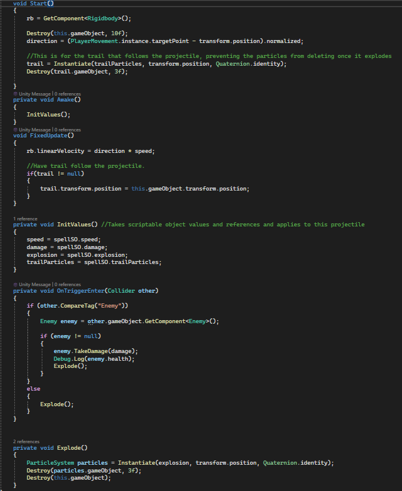

# Loganrap5.github.io
Repository for storing and tracking code developed throughout my course work. 

Here is an example script I wrote for a game that I've been working on. It shows an example of using Scriptable Objects in Unity to apply values
to GameObjects. 

